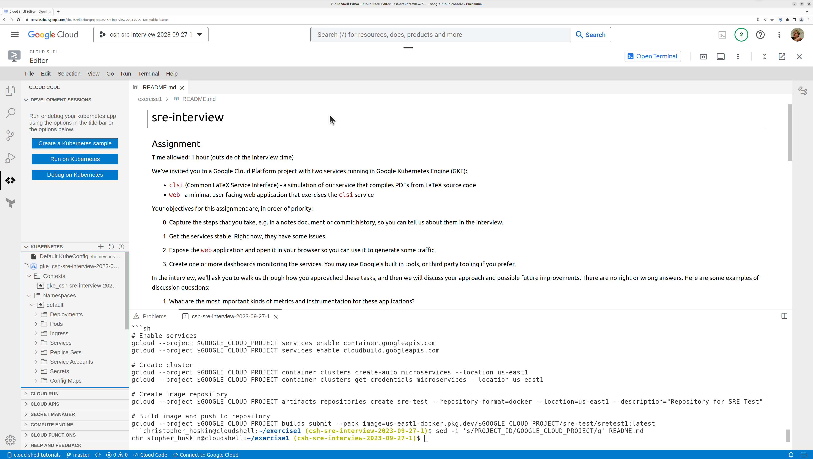

# Overleaf Interview Exercise 1

## Assignment

Time allowed: 1 hour (outside of the interview time)

We've invited you to a Google Cloud Platform project with two services running in Google Kubernetes Engine (GKE):

- `clsi` (Common LaTeX Service Interface) - a simulation of our service that compiles PDFs from LaTeX source code
- `web` - a minimal user-facing web application that exercises the `clsi` service

Your objectives for this assignment are, in order of priority:

0. Capture the steps that you take, e.g. in a notes document or commit history, so you can tell us about them in the interview.

1. Get the services stable. Right now, they have some issues.

2. Figure out how to access the `web` application in your browser so you can use it to generate some traffic.

3. Create one or more dashboards monitoring the services. You may use Google's built in tools, or third party tooling if you prefer.

In the interview, we'll ask you to walk us through how you approached these tasks, and then we will discuss your approach and possible future improvements. There are no right or wrong answers. Here are some examples of discussion questions:

1. What are the most important kinds of metrics and instrumentation for these applications?

2. If these were real-World applications, what recommendations would you make to improve their setup? These may include aspects such as security, cost, performance, stability, etc..

## Working on the assignment

We recommend installing the Google gcloud CLI, as explained here: https://cloud.google.com/sdk/docs/install . Note that on Linux `kubectl` and `skaffold` are available as optional additional packages, see the instruction for how to install these.

If you are unable / unwilling to install software locally, an alternative is to use the [Cloud Shell](https://cloud.google.com/shell/) and [Cloud Shell Editor](https://ide.cloud.google.com/) built into the Google Cloud web console.



## Resources

This repo contains the full source code of the applications and the kubernetes configuration that is currently deployed.

You may make changes to any of the provided files and re-build/re-deploy as you see fit, but note that you should not need to modify the JavaScript code or rebuild the container images to complete this assignment.

The easiest way to deploy the yaml files in this repo is with [`skaffold`](https://skaffold.dev/), which handles updating the image name appropriately and applying everything: 
```sh
export GOOGLE_CLOUD_PROJECT=...as given in your invitation... # This is set by default in Cloud Shell

# Deploy Kubernetes manifests
skaffold deploy --images=image1=us-east1-docker.pkg.dev/$GOOGLE_CLOUD_PROJECT/repo1/image1
```

However, you can use `kubectl apply -f` directly, if you update the image name in the yaml file to match the pattern in the skaffold command shown above.

If you get stuck accessing the cluster, it may help to consult [these docs](https://cloud.google.com/kubernetes-engine/docs/how-to/cluster-access-for-kubectl).

If you get stuck accessing the `web` application, it may help to consult [these docs](https://cloud.google.com/kubernetes-engine/docs/how-to/external-svc-lb-rbs). (And that is not the only way to do it.)

## Background

### Project Setup

For your reference, these were the steps taken to set up your project and cluster. You should not need to repeat any of these steps.

```sh
# Enable services
gcloud --project $GOOGLE_CLOUD_PROJECT services enable container.googleapis.com
gcloud --project $GOOGLE_CLOUD_PROJECT services enable cloudbuild.googleapis.com

# Create cluster
gcloud --project $GOOGLE_CLOUD_PROJECT container clusters create-auto microservices --location us-east1 
gcloud --project $GOOGLE_CLOUD_PROJECT container clusters get-credentials microservices --location us-east1
 
# Create image repository
gcloud --project $GOOGLE_CLOUD_PROJECT artifacts repositories create repo1 --repository-format=docker --location=us-east1 --description="Repository for Exercise 1"

# Build image and push to repository
gcloud --project $GOOGLE_CLOUD_PROJECT builds submit --pack image=us-east1-docker.pkg.dev/$GOOGLE_CLOUD_PROJECT/repo1/image1:latest
```